# Overview
---

# Getting Started with GitLab

This tutorial explains how to create a GitLab project, clone it locally, make changes and push them back to the GitLab server. 

Table of Content  
* [Step 1 - Remove previous GitLab authentications](#step-1)
* [Step 2 - Authenticating with GitLab](#step-2)
* [Step 3 - Create GitLab project](#step-3)
* [Step 4 - Clone a GitLab project locally](#step-4)
* [Step 5 - Making local changes](#step-5)
* [Step 6 - Synchronizing local changes with GitLab](#step-6)
---  

# Step 1
## Remove previous GitLab authentications

The steps below show how to remove any existing previous GitLab authentications.

> Don't worry, this will not delete your GitLab account if you have one.

Go to `Control Panel > User Accounts`

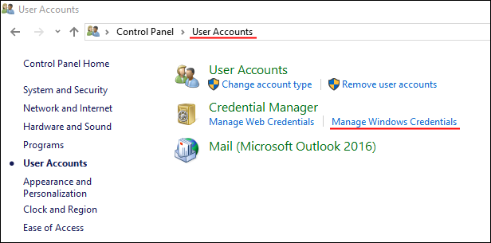

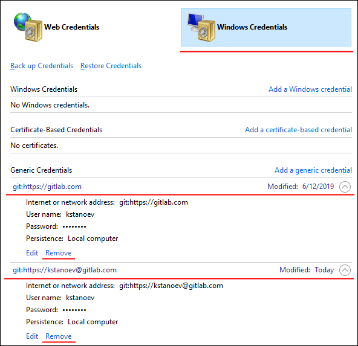

--- 

# Step 2
## Authenticating with GitLab

### Create GitLab user

Go to the [GitLab sign in page](https://gitlab.com/users/sign_in) and either create a new GitLab account or use one of the other options to log in. In this tutorial I am using a Google account to log into GitLab.

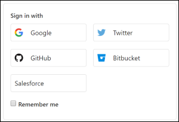


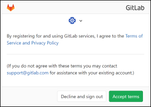

### Create a GitLab password

You have to create a GitLab password which will be used for when you `push` source code from Visual Studio to GitLab.

Go to [Settings of your GitLab account](https://gitlab.com/profile)


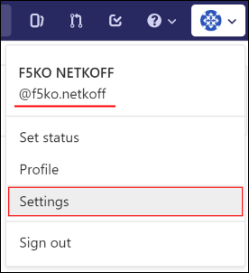

From the menu on the left, select `Password` to create your unique GitLab password.

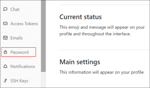

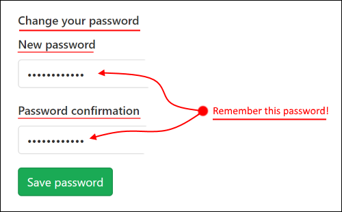

### Log into GitLab

Go to the [GitLab sign in page](https://gitlab.com/users/sign_in) and use your newly created GitLab password.

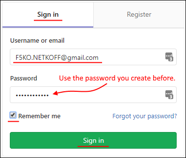

GitLab will redirect you to the home page of your account and prompt you to create a project.

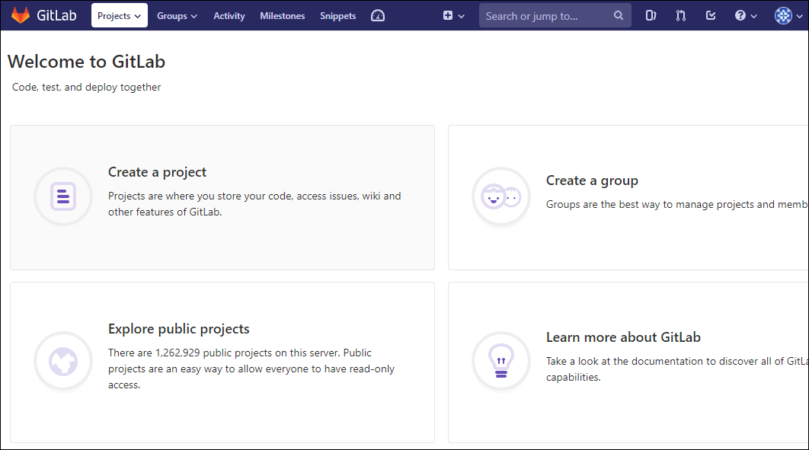

---  

# Step 3
## Create GitLab project

Click the `Create a project` button.

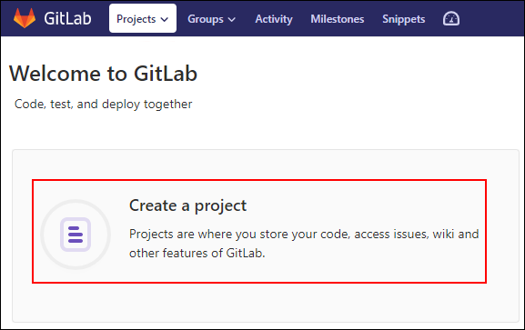

Select `Create from template` and use the .NET Core template.

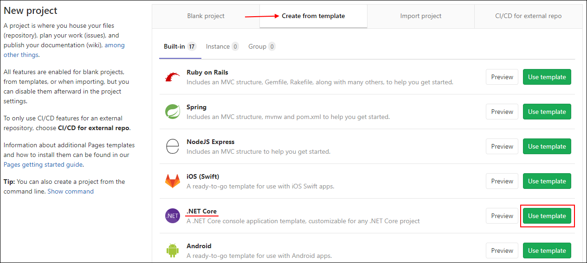

Give your application a name, set its `Visibility` to `Private` and click `Create project`.

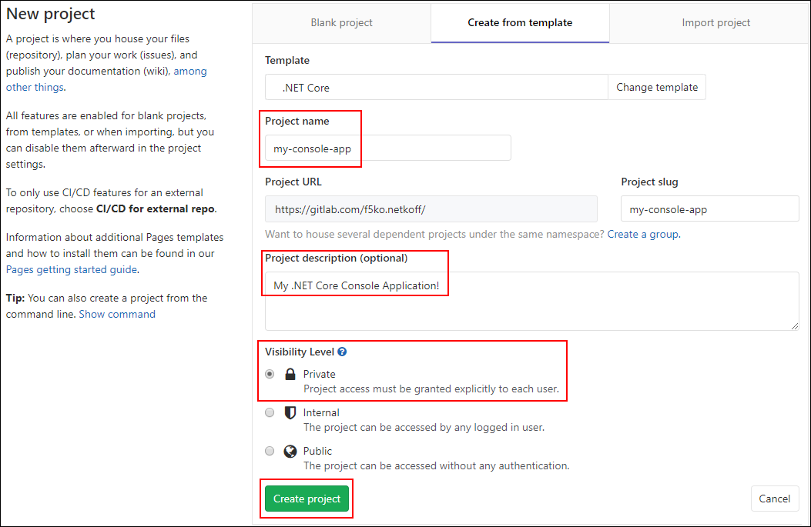

GitLab will generate a repository containing the files necessary for new .NET Core Console Application plus few additional ones. 

Notice that GitLab also generated `.gitignore` and `ReadMe.md` files. Take some time to familiarize yourself with the user interface of GitLab. 

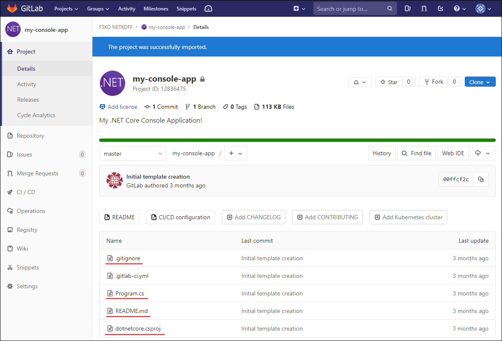

# Step 4
## Clone GitLab project locally

To start making changes to the Console Application that GitLab created, you have to download (clone) it locally on your computer.

Start by obtaining the clone address for the project.

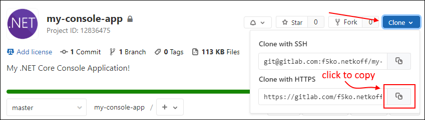

In the copy/paste clipboard you should have an address similar to the one below. 

```
https://gitlab.com/f5ko.netkoff/my-console-app.git
```

**Save it somewhere because we will need later.**

Open Visual Studio 2019 and select `Clone or check out code`.

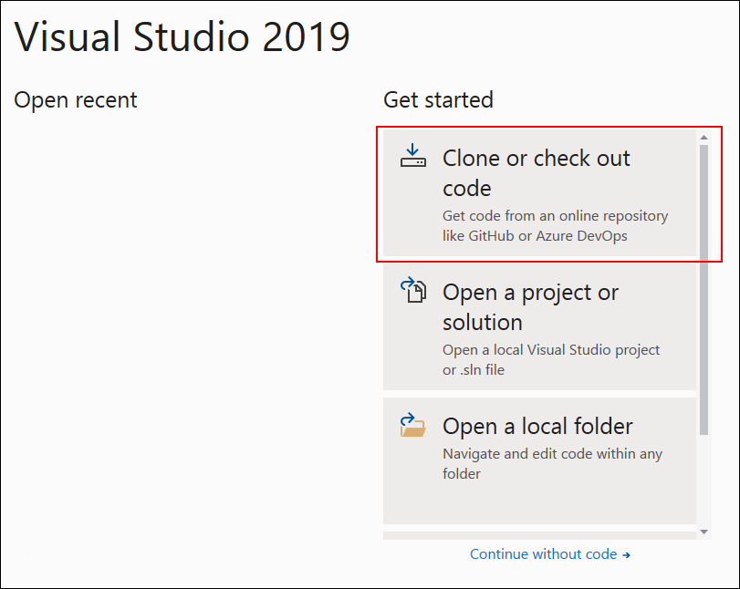

Paste the GitLab clone address into `Repository location` and choose a local folder where the repository will be cloned.

> The local folder **MUST** be empty!

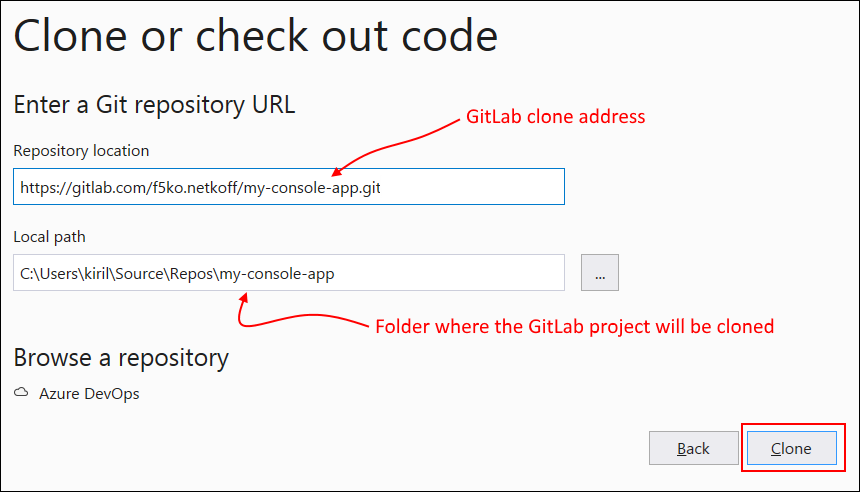

Click the `Clone` button.

Visual Studio will prompt you to enter your GitLab credentials.

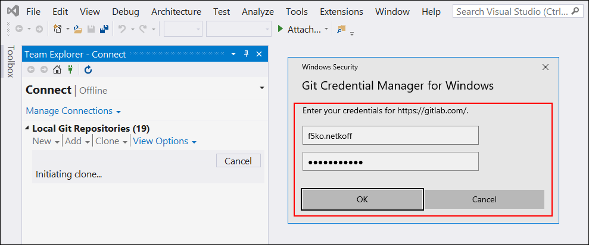

If you have authenticated correctly, Visual Studio will clone the project.

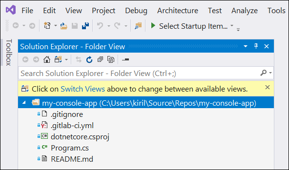

Right-click on the `my-console-app` folder and choose `Open Folder in File Explorer`.

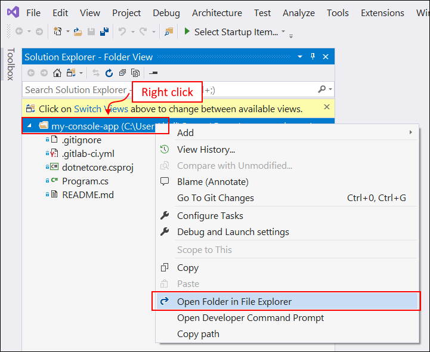

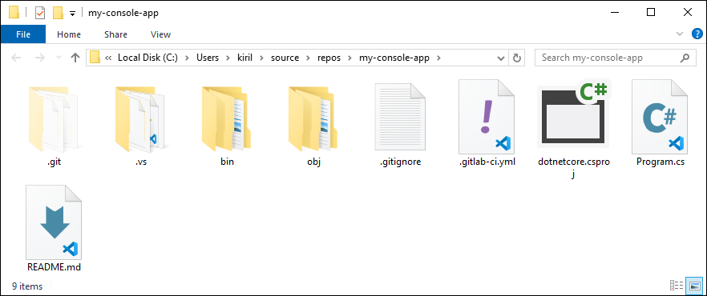

Double-click the `dotnetcore.csproj` file to load it in Visual Studio.

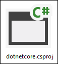

> Note that cloning a GitLab repository does not automatically load it in Visual Studio.


You are now ready to start making changes to the project.

# Step 5
## Making local changes

To confirm that you can synchronize your local changes with the GitLab server, make a small modification in the `Main` method. For example, change `Hello World!` to `GitLab says Hi!`. Rebuild the project to make sure that it compiles successfully.

```csharp
using System;

namespace dotnetcore
{
    class Program
    {
        static void Main(string[] args)
        {
            Console.WriteLine("GitLab says Hi!");
        }
    }
}
```

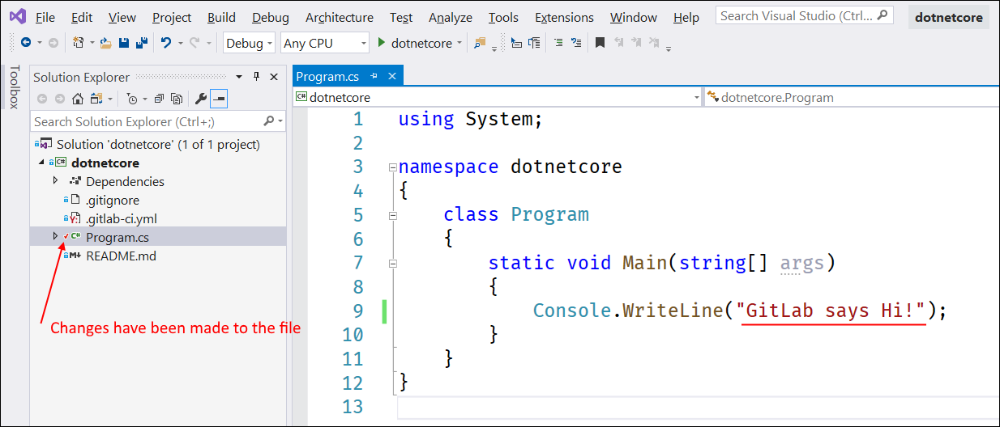

Do you notice the little red tick on the left side of `Program.cs`? It means that the file has been modified locally. 

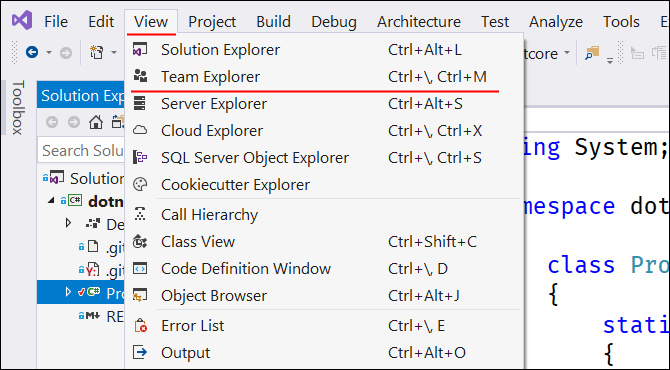

Details about the changes you make to a project can be viewed in the `Team Explorer` panel (`View > Team Explorer`)

Click the `Changes` button.

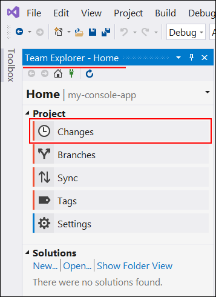


As you can see `Program.cs` is in the list of modified files. 

Sometimes Visual Studio might add files that should not be pushed to the GitLab server. In this case, Visual Studio has created a `.vs` folder which we don't want to upload to the GitLab server.

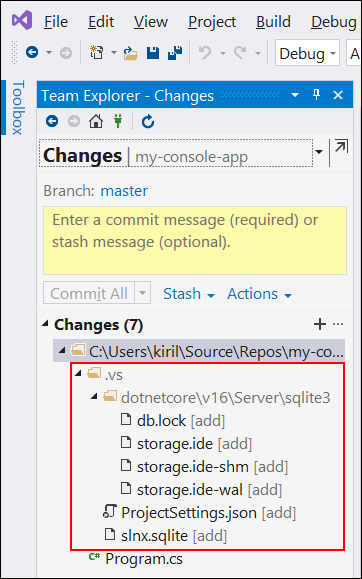

To exclude the `.vs` folder from the synchronization, right click on it and choose `Ignore these local items`

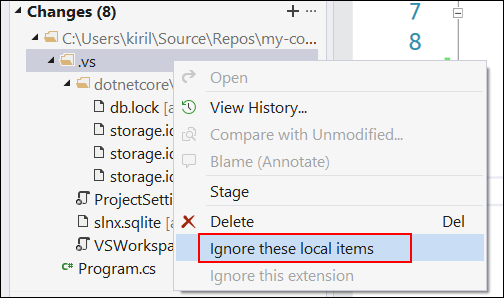

This is update the `.gitignore` file and Visual Studio will no longer sync the `.vs` folder with GitLab.

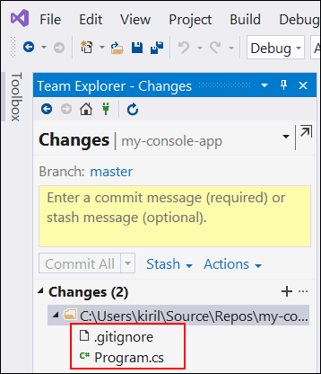

> Both `Program.cs` and `.gitignore` should be synchronized with GitLab.

Before pushing the changes to GitLab, they have to be committed locally. To do that enter a meaningful, descriptive and relatively short commit message and click the `Commit All` button.

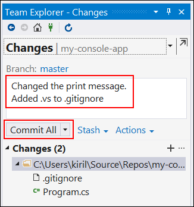

Visual Studio might ask you to save the parent solution file where the `dotnetcore.csproj` project has been residing.

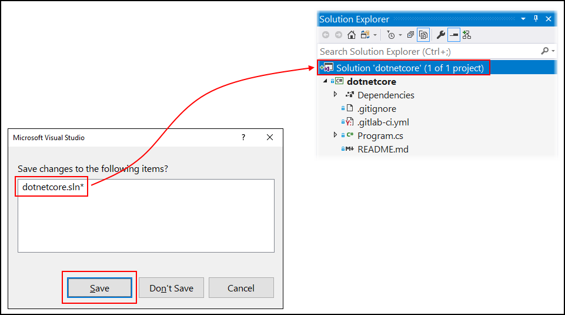

Click the `Save` button and save the solution file in the folder project.

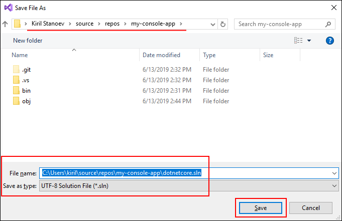

Upon clicking `Save` Visual Studio will commit `.gitignore` and `Program.cs` and will add `dotnetcore.sln` to the list of changed files.

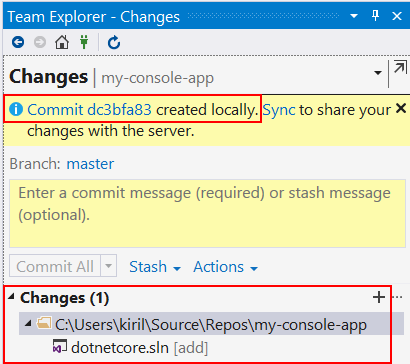

On the image above `Commit dc3bfa83` is the commit for the `.gitignore` and `Program.cs` files. Before synchronizing with the GitLab server, you have to commit `dotnetcore.sln` as well.
As before, add a short message and click `Commit All`.

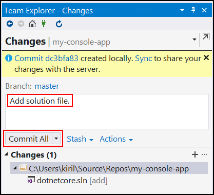

The solution file will be committed locally (`Commit 7ccee1f2`) and no further changes will be present.

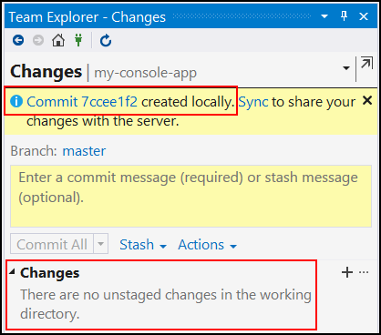

# Step 6
## Synchronizing local changes with GitLab

The final step is to synchronize the 2 local commits (`Commit dc3bfa83` and `Commit 7ccee1f2`) with the GitLab server. To do that, click the little house icon  located at the top of the `Team Explorer` panel. After that click the `Sync` button.

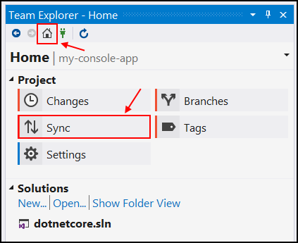

Verify that the commits you want to push are present and click the `Push` button.

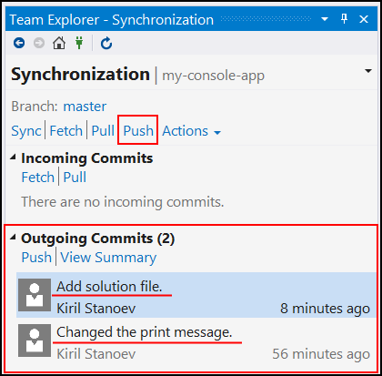

Visual Studio should present you with the following message.

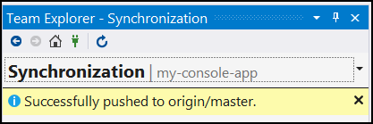

If you want to verify that the commits have reached the GitLab server, examine the project's GitLab page (`https://gitlab.com/f5ko.netkoff/my-console-app`)

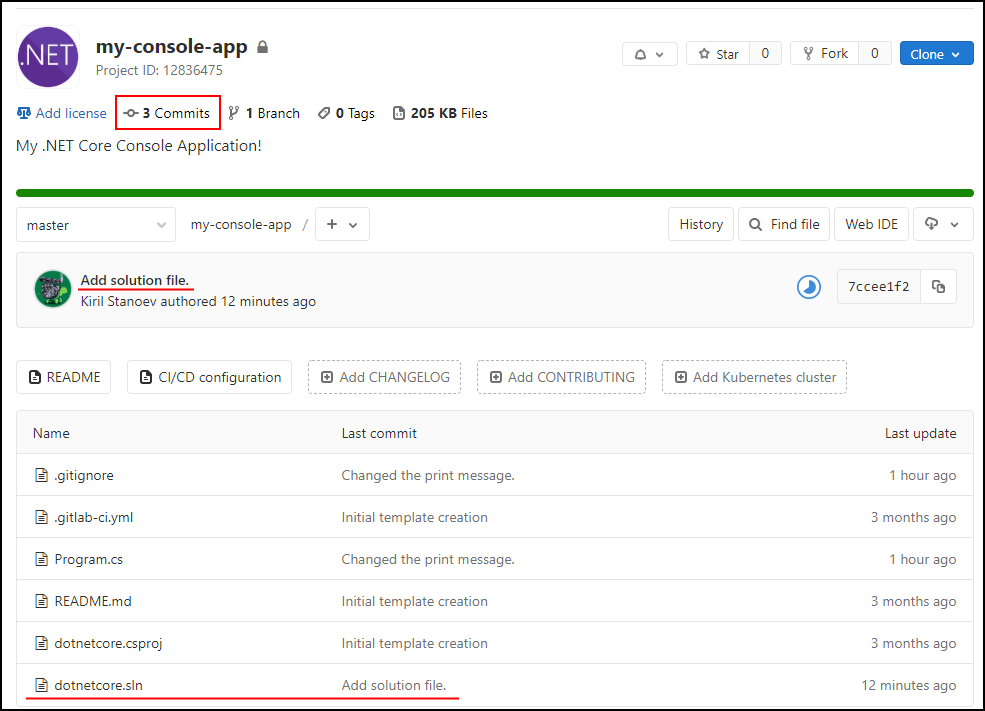

Click the `Program.cs` file and check the message.

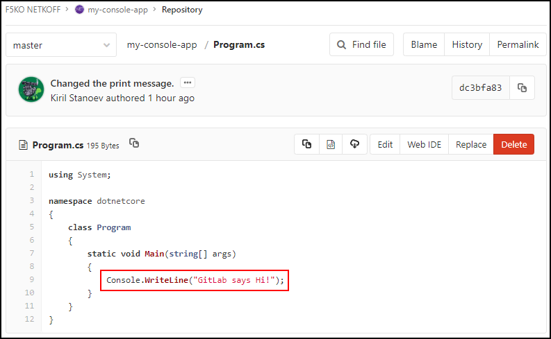

---
