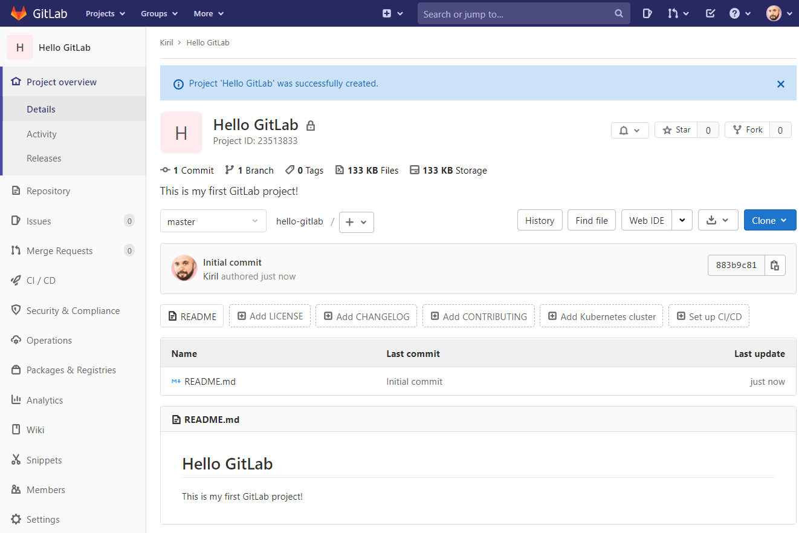

# Getting Started with Git and GitLab using VisualStudio

This tutorial explains how to create a GitLab repository, clone it locally, make changes and push them back to the GitLab server using Visual Studio.

Table of Content  

- [Getting Started with Git and GitLab using VisualStudio](#getting-started-with-git-and-gitlab-using-visualstudio)
  - [Step 0: Notepad++](#step-0-notepad)
  - [Step 1: Git](#step-1-git)
  - [Step 2: GitLab](#step-2-gitlab)
    - [Create a GitLab account](#create-a-gitlab-account)
    - [Log into GitLab](#log-into-gitlab)
  - [Step 3: Create a new GitLab project](#step-3-create-a-new-gitlab-project)
  - [Step 4: Clone a remote GitLab repository locally](#step-4-clone-a-remote-gitlab-repository-locally)
  - [Step 5: View remote GitLab repository's commits](#step-5-view-remote-gitlab-repositorys-commits)

---

## Step 0: Notepad++

Download and install the [Notepad++](https://notepad-plus-plus.org/downloads/) text editor.

## Step 1: Git

Download and install the [Git Source Control Manager](https://git-scm.com/downloads).

---

## Step 2: GitLab

### Create a GitLab account

If you already have a GitLab account, you can skip this step. Otherwise use the [GitLab sign up page](https://gitlab.com/users/sign_up) to create an account.

> It is recommended to create new GitLab credentials instead of using Google, GitHub, Twitter login.

### Log into GitLab

Go to the [GitLab sign in page](https://gitlab.com/users/sign_in) and use your credentials.

---

## Step 3: Create a new GitLab project

There are several ways to create a new GitLab project. We can create a new project from a template or import an already existing project. In this exercise, however, we will create a new _blank_ project by following this link: 

[https://gitlab.com/projects/new#blank_project](https://gitlab.com/projects/new#blank_project)

You should be presented with a form for creating a new blank project. Give your project a name, a description and check the option to add a README file to the repository.

> Think of README files as the documentation page of your repository.

GitLab will create a new repository with a single file in it - the README file.

---

## Step 4: Clone a remote GitLab repository locally

So far, the repository we created in the previous step exists somewhere in the cloud, on one of the many GitLab servers. To be able to work with it locally on our computer we have to _clone_ it. 

Start by obtaining the clone address for the repository.

> You clipboard should have an address similar to `https://gitlab.com/kstanoev/hello-gitlab.git`

**Save it somewhere because we will need later.**

Now, launch Visual Studio and follow the steps below.

The last step - **Commit All and Push** takes the _locally_ stored **HelloWorld Console Application** and uploads it to the GitLab servers.

## Step 5: View remote GitLab repository's commits 

In your web browser open the repository's url - `https://gitlab.com/kstanoev/hello-gitlab` and go to _Repository > Commits_ as shown on the video below.

