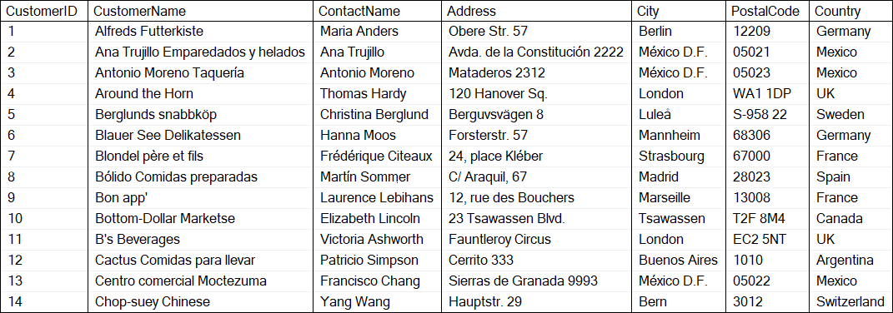

# Introduction to SQL

SQL is a standard language for accessing and manipulating databases.

### What is SQL?
* SQL stands for Structured Query Language
* SQL lets you access and manipulate databases

### What can SQL do?
* SQL can execute queries against a database
* SQL can retrieve data from a database
* SQL can insert records in a database
* SQL can update records in a database
* SQL can delete records from a database
* SQL can create new databases
* SQL can create new tables in a database

### Using SQL

To use SQL you need a database program to store the data. In this course we will be using SQL Server which is an RDBMS. RDBMS stands for Relational Database Management System. The data in RDBMS is stored in database objects called tables. A table is a collection of related data entries and it consists of columns and rows. 

Have a look at the *Customers* table which is part of the Northwind database.

> If you don't have the database, use [Northwind.sql](Northwind.sql) to create it in your SQL Server Management Studio (SSMS).



Every table is broken up into smaller entities called fields. The fields in the *Customers* table consist of `CustomerID`, `CustomerName`, `ContactName`, `Address`, `City`, `PostalCode` and `Country`. A field is a column in a table that is designed to maintain specific information about every record in the table.
A record, also called a row, is each individual entry that exists in a table. For example, there are 91 records in the above *Customers* table. A record is a horizontal entity in a table.
A column is a vertical entity in a table that contains all information associated with a specific field in a table.

### SQL Queries
Most of the actions you need to perform on a database are done with SQL queries. The following SQL query selects all the records in the *Customers* table:
```
SELECT * FROM Customers;
```
> Keep in mind that SQL is NOT case sensitive: `select` is the same as `SELECT`

### SQL Statements

#### SELECT 

The `SELECT` statement is used to select data from a database.
The data returned is stored in a result table, called the result set.

**Syntax**

```
SELECT column1, column2,...
FROM table
```

Here, `column1` and `column2` are the columns in the table you want to select data from. If you want to select all the columns available in the table, use `*`.

```
SELECT * 
FROM table
```

The following SQL query selects the columns *CustomerName* and *City* columns from the *Customers* table.

```
SELECT CustomerName, City 
FROM Customers
```

`Task 1:` How many rows are there in the *Customers* table?

`Answer:`
```
```

---

`Task 2:` Select all the different values from the *Country* column in the *Customers* table. How many countries are there?

`Answer:`
```
```

<details>
<summary><strong>Hint</strong></summary>

Use `SELECT DISTINCT`

</details>

---

#### WHERE

`WHERE` is used for filtering data. It extracts only those records that satisfy some condition.

**Syntax**

```
SELECT column1, column2,...
FROM table
WHERE condition
```

The following selects all customers from Mexico.

```
SELECT * 
FROM Customers
WHERE Country = 'Mexico'
```

> SQL requires single quotation marks around text values. Numeric values do not!

`Task 3:` How many customers are from *London*?

`Answer:`
```
```

---

`Task 4:` What is the *City* and *Country* of the customer with *CustomerID* equal to 64?

`Answer:`
```
```

---

##### Operators
The `WHERE` clause can be combined with `AND`, `OR`, and `NOT` operators.

**Syntax (AND/OR)**

```
SELECT column1, column2,...
FROM table
WHERE condition1 AND condition2 OR condition3...
```

**Syntax (NOT)**
```
SELECT column1, column2,...
FROM table
WHERE NOT condition
```

`Task 5:` How many customers are from *Germany* or *Spain*?

`Answer:`
```
```

---

`Task 6:` How many customers are from *Paris, France* or *Madrid, Spain*?

`Answer:`
```
```

---

`Task 7:` How many customers are from *France* or *Spain*, but are not from *Paris* or *Madrid*?

`Answer:`
```
```
