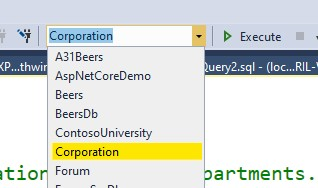

## Instructions

1. Open [Corporation.sql](Corporation.sql) from within SQL Server Management Studio `[ File > Open > File (CTRL + O) ]`
2. Execute the SQL from the file `[ F5 ]`. This should create the Corporation database.
3. Select the newly created database from the list of available databases.
   
   

4. Open [Template.sql](Template.sql) and write your SQL query under each comment. ***SAVE YOUR WORK REGULARLY!***
5. When you're done, zip the file and upload it to learn.